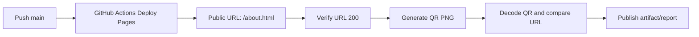
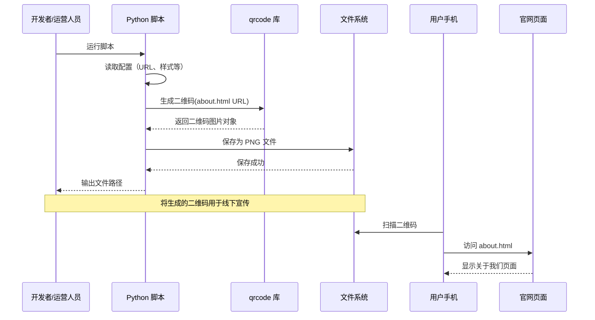
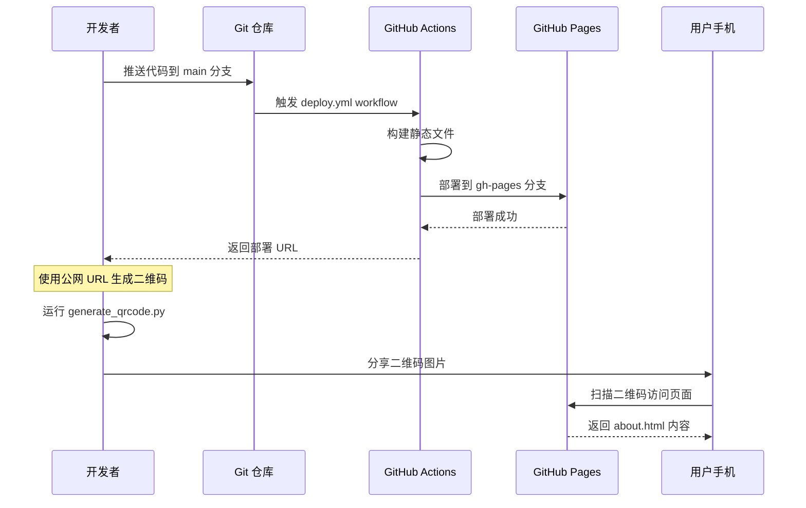

# 设计文档：关于我们页面二维码生成工具

## 概述

生成一个包含"关于我们"页面完整 URL 的二维码图片文件（PNG 格式），用于线下宣传、海报、名片等场景。用户使用手机扫描该二维码后，可直接访问官网的"关于我们"页面（about.html）。该功能通过 Python 脚本实现，生成的二维码图片保存到本地文件系统，不需要在系统前端动态展示。

## 继续设计（V2 聚焦公网 URL 链路）

本轮继续设计重点是把“公网可访问 URL -> 可扫描二维码”做成完整工程链路，覆盖需求 5~10，并且保持与当前 `generate_qrcode.py` 的兼容。

### 目标范围

1. GitHub Pages 自动部署 `ui copy/about.html`，稳定产出公网 URL。
2. 通过配置文件自动构建 URL，避免手写 `https://<user>.github.io/<repo>`。
3. 提供 CLI，一条命令生成二维码并输出可用于海报/名片的 PNG。
4. 增加部署验证：URL 可达性检查 + 二维码可解码性检查。
5. 支持批量生成不同样式二维码，便于多渠道投放。

### 新增模块设计

| 模块 | 职责 | 关键输入 | 关键输出 |
|---|---|---|---|
| `qrcode_config.py` | 读取和校验 `config.json`，构建 GitHub Pages URL | `config.json` | `QRCodeRuntimeConfig` |
| `qrcode_cli.py` | 统一命令行入口，支持单次/批量 | CLI 参数 | 生成结果摘要（成功/失败） |
| `verify_deployment.py` | 校验 URL、解码二维码并比对 URL | URL, PNG | 验证报告（JSON/控制台） |
| `batch_generate.py` | 批量处理多个样式配置 | 配置列表 | 多个 PNG + 统计信息 |
| `.github/workflows/deploy-pages.yml` | 推送后自动发布到 GitHub Pages | `main` 分支代码 | `https://<user>.github.io/<repo>/about.html` |

### 配置模型（建议）

```json
{
  "github_pages": {
    "username": "your-github-user",
    "repository": "your-repo-name",
    "page_path": "/about.html",
    "custom_domain": ""
  },
  "qrcode_default": {
    "size": 10,
    "border": 2,
    "fill_color": "black",
    "back_color": "white",
    "output_path": "output/about_us_qrcode.png"
  },
  "batch_profiles": [
    {
      "name": "poster",
      "size": 14,
      "border": 3,
      "fill_color": "#00f3ff",
      "back_color": "#041129",
      "output_path": "output/about_us_poster.png"
    }
  ]
}
```

### 公网 URL 构建规则

1. 若配置了 `custom_domain`，使用 `https://<custom_domain><page_path>`。
2. 否则使用 `https://<username>.github.io/<repository><page_path>`。
3. `page_path` 默认为 `/about.html`，必须以 `/` 开头。

### CLI 设计（建议命令）

```bash
# 单次生成（显式 URL）
python qrcode_cli.py generate --url https://user.github.io/repo/about.html --output output/about.png

# 从配置生成
python qrcode_cli.py from-config --config config.json

# 批量生成
python qrcode_cli.py batch --config config.json

# 部署验证（URL + 二维码）
python qrcode_cli.py verify --url https://user.github.io/repo/about.html --qrcode output/about.png
```

### 端到端流程（部署后自动生成）



### 关键非功能约束

1. 单个二维码生成目标 < 200ms（本地，不含网络验证）。
2. 验证脚本网络超时默认 8 秒，可通过参数覆盖。
3. 批量任务失败隔离：单个 profile 失败不影响其他任务。
4. 所有失败必须返回可定位原因（参数/网络/文件系统/解码）。

## 架构设计

### 系统架构图


### 工作流程图



## 核心接口与类型

### 二维码生成脚本

```python
#!/usr/bin/env python3
"""
关于我们页面二维码生成脚本
生成包含 about.html 完整 URL 的二维码图片
"""

import qrcode
from pathlib import Path
from typing import Optional

def generate_about_us_qrcode(
    base_url: str,
    output_path: str = "about_us_qrcode.png",
    size: int = 10,
    border: int = 2,
    fill_color: str = "black",
    back_color: str = "white"
) -> Path:
    """
    生成关于我们页面的二维码图片
    
    Args:
        base_url: 网站基础 URL（如 http://localhost:8080）
        output_path: 输出文件路径
        size: 二维码大小（1-40）
        border: 边框宽度
        fill_color: 前景色
        back_color: 背景色
    
    Returns:
        Path: 生成的二维码文件路径
    """
    pass
```

### 配置数据结构

```python
from dataclasses import dataclass

@dataclass
class QRCodeConfig:
    """二维码配置"""
    base_url: str                    # 网站基础 URL
    page_path: str = "/about.html"   # 页面路径
    output_dir: str = "./output"     # 输出目录
    filename: str = "about_us_qrcode.png"  # 文件名
    size: int = 10                   # 二维码大小
    border: int = 2                  # 边框宽度
    fill_color: str = "black"        # 前景色
    back_color: str = "white"        # 背景色
```

## 主要算法流程

### 二维码生成算法

```python
ALGORITHM generateAboutUsQRCode(base_url, output_path, config)
INPUT: base_url (字符串), output_path (字符串), config (配置对象)
OUTPUT: file_path (Path 对象)

BEGIN
  # 前置条件检查
  ASSERT base_url IS NOT NULL AND base_url IS NOT EMPTY
  ASSERT config.size >= 1 AND config.size <= 40
  ASSERT config.border >= 0
  
  # 步骤 1: 构建完整 URL
  full_url ← base_url + "/about.html"
  
  # 步骤 2: 创建二维码对象
  qr ← QRCode(
    version=1,
    error_correction=ERROR_CORRECT_L,
    box_size=config.size,
    border=config.border
  )
  
  # 步骤 3: 添加数据并生成
  qr.add_data(full_url)
  qr.make(fit=True)
  
  # 步骤 4: 生成图片对象
  img ← qr.make_image(
    fill_color=config.fill_color,
    back_color=config.back_color
  )
  
  # 步骤 5: 确保输出目录存在
  output_dir ← Path(output_path).parent
  IF NOT output_dir.exists() THEN
    output_dir.mkdir(parents=True)
  END IF
  
  # 步骤 6: 保存图片到文件
  img.save(output_path)
  
  # 步骤 7: 验证文件已创建
  file_path ← Path(output_path)
  ASSERT file_path.exists()
  ASSERT file_path.stat().st_size > 0
  
  # 步骤 8: 输出成功信息
  PRINT "二维码已生成: " + str(file_path.absolute())
  PRINT "扫描后访问: " + full_url
  
  # 后置条件检查
  ASSERT file_path IS NOT NULL
  ASSERT file_path.exists()
  
  RETURN file_path
END
```

**前置条件**:
- base_url 不为空且格式有效
- config.size 在 1-40 范围内
- config.border 非负
- 有文件系统写入权限

**后置条件**:
- 返回有效的文件路径
- 文件存在于文件系统中
- 文件大小大于 0
- 二维码包含正确的 URL

**循环不变式**: 不适用（无循环）

## 核心函数规范

### 函数: generate_about_us_qrcode()

```python
def generate_about_us_qrcode(
    base_url: str,
    output_path: str = "about_us_qrcode.png",
    size: int = 10,
    border: int = 2,
    fill_color: str = "black",
    back_color: str = "white"
) -> Path
```

**前置条件**:
- `base_url` 不为空字符串且格式有效（如 http://localhost:8080 或 https://example.com）
- `size` 在 1-40 范围内
- `border` 大于等于 0
- `output_path` 指向的目录存在或可创建
- `fill_color` 和 `back_color` 是有效的颜色值（颜色名称或十六进制）

**后置条件**:
- 返回有效的 Path 对象，指向生成的 PNG 文件
- 文件存在于文件系统中
- 文件大小大于 0 字节
- 生成的二维码包含完整的 URL（base_url + /about.html）
- 二维码可被标准扫码器识别并正确解析出 URL

**循环不变式**: 不适用（无循环）

## 示例用法

### 基本使用示例

```python
#!/usr/bin/env python3
"""
示例 1: 基本用法 - 生成默认样式的二维码
"""
from generate_qrcode import generate_about_us_qrcode

# 生成二维码（使用默认参数）
qr_path = generate_about_us_qrcode(
    base_url="http://localhost:8080"
)
print(f"二维码已生成: {qr_path}")
# 输出: 二维码已生成: about_us_qrcode.png
```

### 自定义样式示例

```python
#!/usr/bin/env python3
"""
示例 2: 自定义样式 - 生成符合品牌色的二维码
"""
from generate_qrcode import generate_about_us_qrcode

# 生成自定义样式的二维码（匹配网站科技蓝主题）
qr_path = generate_about_us_qrcode(
    base_url="https://example.com",
    output_path="./output/about_us_qrcode_branded.png",
    size=15,
    border=3,
    fill_color="#00f3ff",  # 科技蓝
    back_color="#041129"   # 深色背景
)
print(f"品牌二维码已生成: {qr_path}")
```

### 命令行工具示例

```python
#!/usr/bin/env python3
"""
示例 3: 命令行工具 - 支持参数化生成
"""
import argparse
from generate_qrcode import generate_about_us_qrcode

def main():
    parser = argparse.ArgumentParser(description="生成关于我们页面的二维码")
    parser.add_argument("--url", required=True, help="网站基础 URL")
    parser.add_argument("--output", default="about_us_qrcode.png", help="输出文件路径")
    parser.add_argument("--size", type=int, default=10, help="二维码大小 (1-40)")
    parser.add_argument("--border", type=int, default=2, help="边框宽度")
    
    args = parser.parse_args()
    
    qr_path = generate_about_us_qrcode(
        base_url=args.url,
        output_path=args.output,
        size=args.size,
        border=args.border
    )
    
    print(f"✓ 二维码生成成功: {qr_path.absolute()}")
    print(f"✓ 扫描后访问: {args.url}/about.html")

if __name__ == "__main__":
    main()
```

**命令行使用**:
```bash
# 基本用法
python generate_qrcode.py --url http://localhost:8080

# 自定义输出路径和大小
python generate_qrcode.py --url https://example.com --output ./qrcodes/about.png --size 15

# 生产环境使用
python generate_qrcode.py --url https://www.yourcompany.com --output ./marketing/about_qr.png --size 20 --border 4
```

## 正确性属性

*属性是关于系统行为的形式化陈述，应该在所有有效执行中保持为真。属性是人类可读规范和机器可验证正确性保证之间的桥梁。*

### 属性 1: 二维码 Round-Trip 一致性

*对于任何*有效的 base_url，生成二维码后扫描解码得到的 URL 必须与输入的 base_url + /about.html 完全一致

**验证需求**: 需求 1.1, 4.2, 4.3

### 属性 2: PNG 文件格式有效性

*对于任何*成功生成的二维码文件，该文件必须是有效的 PNG 格式（包含正确的文件头），文件大小大于 0 字节，且可被标准图片查看器打开

**验证需求**: 需求 1.2, 4.1, 4.4

### 属性 3: 样式参数正确应用

*对于任何*有效的样式参数组合（size、border、fill_color、back_color），生成的二维码必须正确应用这些参数，且参数值可从生成的图片中验证

**验证需求**: 需求 2.1, 2.2, 2.3, 2.4

### 属性 4: 输入参数验证

*对于任何*无效的输入参数（空 URL、无效 URL 格式、超出范围的 size、负数 border），系统必须抛出相应的 ValueError 异常并提供清晰的错误消息

**验证需求**: 需求 3.1, 3.2, 3.3, 3.4

### 属性 5: 输出目录自动创建

*对于任何*不存在的输出目录路径，系统必须自动创建所需的目录结构，且生成的文件能够成功保存到该路径

**验证需求**: 需求 3.5

### 属性 6: 配置文件处理正确性

*对于任何*有效的 config.json 文件，系统必须正确解析配置参数，构建完整的 GitHub Pages URL，并使用配置的样式参数生成二维码

**验证需求**: 需求 6.1, 6.2, 6.3

### 属性 7: 配置文件错误处理

*对于任何*不存在或格式错误的配置文件，系统必须抛出异常并提供详细的错误信息

**验证需求**: 需求 6.4

### 属性 8: 命令行参数解析正确性

*对于任何*通过命令行提供的参数（--url、--output、--size、--border），系统必须正确解析并应用这些参数，生成的二维码反映这些参数值

**验证需求**: 需求 7.1, 7.2, 7.3

### 属性 9: 批量生成独立性

*对于任何*包含多个配置的列表，系统必须为每个配置生成独立的二维码文件，且某个配置失败不影响其他配置的处理

**验证需求**: 需求 9.1, 9.2, 9.3

### 属性 10: 批量生成统计准确性

*对于任何*批量生成任务，系统输出的成功和失败统计信息必须与实际生成结果一致

**验证需求**: 需求 9.4

### 属性 11: 文件大小合理性

*对于任何*生成的二维码文件，文件大小必须在合理范围内（1-5KB），取决于配置的 size 和 border 参数

**验证需求**: 需求 10.2

### 属性 12: 控制台输出完整性

*对于任何*成功的二维码生成操作，控制台输出必须包含文件的绝对路径和完整 URL 信息

**验证需求**: 需求 1.4

### 属性 13: 幂等性

*对于任何*相同的输入参数组合，多次执行生成操作应产生内容相同的二维码文件（文件可能被覆盖，但内容一致）

**验证需求**: 通用正确性属性（设计文档原有）

## 错误处理

### 错误场景 1: URL 无效

**条件**: 传入的 base_url 格式不正确或为空
**响应**: 抛出 ValueError 异常，包含错误信息
**恢复**: 脚本终止，提示用户检查 URL 格式

### 错误场景 2: 文件写入权限不足

**条件**: 输出目录不存在且无法创建，或无写入权限
**响应**: 抛出 PermissionError 或 OSError 异常
**恢复**: 脚本终止，提示用户检查文件系统权限或更改输出路径

### 错误场景 3: 二维码生成失败

**条件**: qrcode 库抛出异常（如参数无效）
**响应**: 捕获异常并记录错误信息
**恢复**: 脚本终止，输出详细错误日志

### 错误场景 4: 磁盘空间不足

**条件**: 文件系统空间不足，无法保存图片
**响应**: 抛出 OSError 异常
**恢复**: 脚本终止，提示用户清理磁盘空间

## 测试策略

### 单元测试方法

**测试目标**:
- 二维码生成函数的正确性
- 参数验证逻辑
- 错误处理机制
- 文件系统操作

**关键测试用例**:
1. 测试有效 URL 生成二维码文件
2. 测试无效 URL 抛出异常
3. 测试自定义参数生效（大小、颜色、边框）
4. 测试边界值（size=1, size=40, border=0）
5. 测试空字符串和 None 处理
6. 测试输出目录自动创建
7. 测试文件覆盖行为
8. 测试生成的文件可读性

**示例测试代码**:
```python
import pytest
from pathlib import Path
from generate_qrcode import generate_about_us_qrcode

def test_generate_qrcode_with_valid_url(tmp_path):
    """测试有效 URL 生成二维码"""
    output = tmp_path / "test_qr.png"
    result = generate_about_us_qrcode(
        base_url="http://localhost:8080",
        output_path=str(output)
    )
    assert result.exists()
    assert result.stat().st_size > 0

def test_generate_qrcode_with_invalid_url():
    """测试无效 URL 抛出异常"""
    with pytest.raises(ValueError):
        generate_about_us_qrcode(base_url="")

def test_qrcode_content_is_valid_png(tmp_path):
    """测试生成的文件是有效的 PNG"""
    output = tmp_path / "test_qr.png"
    result = generate_about_us_qrcode(
        base_url="http://example.com",
        output_path=str(output)
    )
    with open(result, "rb") as f:
        header = f.read(8)
        assert header == b'\x89PNG\r\n\x1a\n'
```

### 属性测试方法

**属性测试库**: pytest + hypothesis (Python)

**测试属性**:
1. 可扫描性：生成的二维码可被解码
2. 幂等性：相同输入产生相同输出
3. 格式正确性：输出是有效的 PNG 图片
4. URL 一致性：扫描结果与输入 URL 一致

**示例属性测试**:

```python
from hypothesis import given, strategies as st
import pytest
from PIL import Image
import pyzbar.pyzbar as pyzbar

@given(st.text(min_size=10, max_size=100, alphabet=st.characters(whitelist_categories=('Lu', 'Ll', 'Nd'))))
def test_qrcode_generation_always_produces_scannable_code(url_suffix, tmp_path):
    """属性测试：任何有效 URL 都能生成可扫描的二维码"""
    base_url = f"http://example.com/{url_suffix}"
    output = tmp_path / "test_qr.png"
    
    result = generate_about_us_qrcode(
        base_url=base_url,
        output_path=str(output)
    )
    
    # 验证文件存在
    assert result.exists()
    
    # 验证可扫描
    img = Image.open(result)
    decoded = pyzbar.decode(img)
    assert len(decoded) > 0
    assert decoded[0].data.decode() == f"{base_url}/about.html"
```

### 集成测试方法

**测试目标**:
- 完整的脚本执行流程
- 命令行参数解析
- 文件系统交互
- 实际扫码验证

**测试场景**:
1. 命令行工具完整执行
2. 不同参数组合测试
3. 输出目录不存在时自动创建
4. 文件覆盖场景
5. 使用真实扫码器验证（手动测试）

## 性能考虑

### 执行时间

- 二维码生成时间：< 100ms（单个二维码）
- 文件写入时间：< 50ms（取决于磁盘性能）
- 总执行时间：< 200ms

### 资源使用

- 内存占用：< 10MB（生成单个二维码）
- 磁盘空间：每个二维码约 1-5KB（取决于大小和复杂度）
- CPU 使用：低（二维码生成是轻量级操作）

### 批量生成优化

如需批量生成多个二维码（不同 URL 或样式）：
- 可使用多进程并行处理
- 预先验证所有输入参数
- 统一创建输出目录结构

## 安全考虑

### URL 验证

- 验证 base_url 格式的合法性（http:// 或 https:// 开头）
- 限制 URL 长度（避免生成过大的二维码）
- 防止路径遍历攻击（验证输出路径）

### 文件系统安全

- 验证输出路径不包含危险字符（如 ..）
- 确保只写入指定目录
- 设置合理的文件权限

### 数据安全

- 二维码中不包含敏感信息（仅包含公开的 URL）
- 生成的二维码文件可公开分享
- 建议在生产环境使用 HTTPS URL

## 依赖项

### Python 依赖

```txt
qrcode[pil]==7.4.2
Pillow==10.2.0
```

### 可选依赖（用于测试）

```txt
pytest==7.4.3
hypothesis==6.92.1
pyzbar==0.1.9  # 用于验证二维码可扫描性
```

### 系统要求

- Python 3.8+
- 文件系统写入权限
- 足够的磁盘空间（每个二维码约 1-5KB）

## GitHub Pages 部署方案

### 部署概述

为了让生成的二维码可以被任何人扫描访问，需要将 `ui copy/about.html` 部署到 GitHub Pages，获得公网可访问的 URL。完整流程包括：

1. 配置 GitHub Pages 自动部署
2. 推送代码触发部署
3. 获取公网 URL
4. 使用公网 URL 生成二维码
5. 验证部署和二维码可访问性

### 部署架构图



### GitHub Actions 部署配置

创建 `.github/workflows/deploy.yml` 文件：

```yaml
name: Deploy to GitHub Pages

on:
  push:
    branches:
      - main  # 或 master，根据你的默认分支
  workflow_dispatch:  # 允许手动触发

permissions:
  contents: read
  pages: write
  id-token: write

concurrency:
  group: "pages"
  cancel-in-progress: false

jobs:
  deploy:
    runs-on: ubuntu-latest
    
    steps:
      - name: Checkout repository
        uses: actions/checkout@v4
      
      - name: Setup Pages
        uses: actions/configure-pages@v4
      
      - name: Copy files to deployment directory
        run: |
          mkdir -p _site
          cp -r "ui copy"/* _site/
          # 如果有其他静态资源（CSS、JS、图片等），也复制过去
          # cp -r assets _site/ 2>/dev/null || true
      
      - name: Upload artifact
        uses: actions/upload-pages-artifact@v3
        with:
          path: '_site'
      
      - name: Deploy to GitHub Pages
        id: deployment
        uses: actions/deploy-pages@v4
```

### 仓库设置步骤

#### 步骤 1: 启用 GitHub Pages

1. 进入 GitHub 仓库页面
2. 点击 `Settings` (设置)
3. 在左侧菜单找到 `Pages`
4. 在 `Source` 下拉菜单中选择 `GitHub Actions`
5. 保存设置

#### 步骤 2: 创建 Workflow 文件

```bash
# 在项目根目录执行
mkdir -p .github/workflows
# 创建 deploy.yml 文件（内容见上方配置）
```

#### 步骤 3: 推送代码触发部署

```bash
git add .github/workflows/deploy.yml
git add "ui copy/about.html"
git commit -m "Add GitHub Pages deployment workflow"
git push origin main
```

#### 步骤 4: 查看部署状态

1. 进入仓库的 `Actions` 标签页
2. 查看 "Deploy to GitHub Pages" workflow 运行状态
3. 等待部署完成（通常 1-3 分钟）

#### 步骤 5: 获取部署后的 URL

部署成功后，访问 URL 格式为：

```
https://<username>.github.io/<repository-name>/about.html
```

**示例**:
- 用户名: `cloudexplorer`
- 仓库名: `methane-monitoring`
- 完整 URL: `https://cloudexplorer.github.io/methane-monitoring/about.html`

### 使用公网 URL 生成二维码

#### 更新后的脚本示例

```python
#!/usr/bin/env python3
"""
使用 GitHub Pages 公网 URL 生成二维码
"""
from generate_qrcode import generate_about_us_qrcode

# 方式 1: 直接使用完整 URL
github_pages_url = "https://cloudexplorer.github.io/methane-monitoring/about.html"

qr_path = generate_about_us_qrcode(
    base_url=github_pages_url.rsplit('/', 1)[0],  # 去掉 /about.html
    output_path="./output/about_us_qrcode_public.png",
    size=15,
    border=3
)

print(f"✓ 公网二维码已生成: {qr_path.absolute()}")
print(f"✓ 扫描后访问: {github_pages_url}")
```

#### 方式 2: 配置文件管理

创建 `config.json` 配置文件：

```json
{
  "github_pages": {
    "username": "cloudexplorer",
    "repository": "methane-monitoring",
    "page_path": "about.html"
  },
  "qrcode": {
    "output_dir": "./output",
    "filename": "about_us_qrcode_public.png",
    "size": 15,
    "border": 3,
    "fill_color": "#00f3ff",
    "back_color": "#041129"
  }
}
```

增强版生成脚本：

```python
#!/usr/bin/env python3
"""
从配置文件读取 GitHub Pages URL 并生成二维码
"""
import json
from pathlib import Path
from generate_qrcode import generate_about_us_qrcode

def load_config(config_path: str = "config.json") -> dict:
    """加载配置文件"""
    with open(config_path, 'r', encoding='utf-8') as f:
        return json.load(f)

def build_github_pages_url(config: dict) -> str:
    """构建 GitHub Pages URL"""
    gh = config['github_pages']
    return f"https://{gh['username']}.github.io/{gh['repository']}/{gh['page_path']}"

def main():
    # 加载配置
    config = load_config()
    
    # 构建完整 URL
    full_url = build_github_pages_url(config)
    base_url = full_url.rsplit('/', 1)[0]
    
    # 获取二维码配置
    qr_config = config['qrcode']
    output_path = Path(qr_config['output_dir']) / qr_config['filename']
    
    # 生成二维码
    qr_path = generate_about_us_qrcode(
        base_url=base_url,
        output_path=str(output_path),
        size=qr_config['size'],
        border=qr_config['border'],
        fill_color=qr_config['fill_color'],
        back_color=qr_config['back_color']
    )
    
    print(f"✓ 公网二维码已生成: {qr_path.absolute()}")
    print(f"✓ 扫描后访问: {full_url}")
    print(f"✓ 配置来源: config.json")

if __name__ == "__main__":
    main()
```

### 部署验证方法

#### 验证 1: 浏览器访问测试

```bash
# 在浏览器中打开部署的 URL
# 检查页面是否正常显示
# 检查所有资源（CSS、JS、图片）是否加载成功
```

**验证清单**:
- [ ] 页面可以正常访问（HTTP 200）
- [ ] 页面样式正确显示
- [ ] 交互功能正常工作
- [ ] 无控制台错误

#### 验证 2: 二维码扫描测试

```python
#!/usr/bin/env python3
"""
验证生成的二维码是否可扫描并包含正确 URL
"""
from PIL import Image
import pyzbar.pyzbar as pyzbar

def verify_qrcode(qr_image_path: str, expected_url: str) -> bool:
    """
    验证二维码内容
    
    Args:
        qr_image_path: 二维码图片路径
        expected_url: 期望的 URL
    
    Returns:
        bool: 验证是否通过
    """
    try:
        # 读取二维码图片
        img = Image.open(qr_image_path)
        
        # 解码二维码
        decoded_objects = pyzbar.decode(img)
        
        if not decoded_objects:
            print("❌ 二维码无法识别")
            return False
        
        # 获取解码后的 URL
        decoded_url = decoded_objects[0].data.decode('utf-8')
        
        # 验证 URL 是否匹配
        if decoded_url == expected_url:
            print(f"✓ 二维码验证通过")
            print(f"  解码 URL: {decoded_url}")
            return True
        else:
            print(f"❌ URL 不匹配")
            print(f"  期望: {expected_url}")
            print(f"  实际: {decoded_url}")
            return False
            
    except Exception as e:
        print(f"❌ 验证失败: {e}")
        return False

# 使用示例
if __name__ == "__main__":
    qr_path = "./output/about_us_qrcode_public.png"
    expected = "https://cloudexplorer.github.io/methane-monitoring/about.html"
    
    verify_qrcode(qr_path, expected)
```

#### 验证 3: 移动设备真机测试

**测试步骤**:
1. 将生成的二维码图片发送到手机
2. 使用手机相机或微信扫一扫功能扫描
3. 确认能够正确跳转到 GitHub Pages 页面
4. 检查页面在移动端的显示效果
5. 测试页面交互功能

**测试设备建议**:
- iOS 设备（iPhone）
- Android 设备
- 不同浏览器（Safari、Chrome、微信内置浏览器）

#### 验证 4: 网络可达性测试

```bash
# 使用 curl 测试 URL 可访问性
curl -I https://cloudexplorer.github.io/methane-monitoring/about.html

# 期望输出：HTTP/2 200
```

```python
#!/usr/bin/env python3
"""
自动化网络可达性测试
"""
import requests

def test_url_accessibility(url: str) -> bool:
    """
    测试 URL 是否可访问
    
    Args:
        url: 要测试的 URL
    
    Returns:
        bool: 是否可访问
    """
    try:
        response = requests.get(url, timeout=10)
        
        if response.status_code == 200:
            print(f"✓ URL 可访问: {url}")
            print(f"  状态码: {response.status_code}")
            print(f"  响应时间: {response.elapsed.total_seconds():.2f}s")
            return True
        else:
            print(f"❌ URL 访问异常")
            print(f"  状态码: {response.status_code}")
            return False
            
    except requests.exceptions.RequestException as e:
        print(f"❌ 网络请求失败: {e}")
        return False

# 使用示例
if __name__ == "__main__":
    url = "https://cloudexplorer.github.io/methane-monitoring/about.html"
    test_url_accessibility(url)
```

### 部署故障排查

#### 问题 1: 部署失败 (Workflow 报错)

**可能原因**:
- GitHub Pages 未启用
- 权限配置不正确
- 文件路径错误

**解决方案**:
```yaml
# 确保 workflow 文件中包含正确的权限配置
permissions:
  contents: read
  pages: write
  id-token: write
```

#### 问题 2: 页面 404 错误

**可能原因**:
- 文件路径不正确
- 部署目录结构错误
- URL 拼写错误

**解决方案**:
```bash
# 检查部署后的文件结构
# 在 Actions 日志中查看 "Upload artifact" 步骤
# 确认 about.html 在根目录
```

#### 问题 3: 样式或资源加载失败

**可能原因**:
- 静态资源路径使用了绝对路径
- CSS/JS 文件未包含在部署中

**解决方案**:
```html
<!-- 修改 about.html 中的资源引用 -->
<!-- 错误：绝对路径 -->
<link rel="stylesheet" href="/css/style.css">

<!-- 正确：相对路径或 CDN -->
<link rel="stylesheet" href="./css/style.css">
<!-- 或使用 CDN -->
<link rel="stylesheet" href="https://cdn.example.com/style.css">
```

#### 问题 4: 二维码扫描后无法访问

**可能原因**:
- URL 格式错误
- GitHub Pages 部署未完成
- 网络连接问题

**解决方案**:
```python
# 验证生成的二维码内容
from PIL import Image
import pyzbar.pyzbar as pyzbar

img = Image.open("about_us_qrcode_public.png")
decoded = pyzbar.decode(img)
print(f"二维码内容: {decoded[0].data.decode()}")

# 手动在浏览器中测试该 URL
```

### 完整部署流程示例

```bash
# 步骤 1: 创建 workflow 文件
mkdir -p .github/workflows
cat > .github/workflows/deploy.yml << 'EOF'
name: Deploy to GitHub Pages
on:
  push:
    branches: [main]
  workflow_dispatch:
permissions:
  contents: read
  pages: write
  id-token: write
jobs:
  deploy:
    runs-on: ubuntu-latest
    steps:
      - uses: actions/checkout@v4
      - uses: actions/configure-pages@v4
      - run: |
          mkdir -p _site
          cp -r "ui copy"/* _site/
      - uses: actions/upload-pages-artifact@v3
        with:
          path: '_site'
      - uses: actions/deploy-pages@v4
EOF

# 步骤 2: 提交并推送
git add .github/workflows/deploy.yml
git commit -m "Add GitHub Pages deployment"
git push origin main

# 步骤 3: 等待部署完成（查看 Actions 页面）
# 访问: https://github.com/<username>/<repo>/actions

# 步骤 4: 获取部署 URL
# 格式: https://<username>.github.io/<repo>/about.html

# 步骤 5: 生成二维码
python3 << 'EOF'
from generate_qrcode import generate_about_us_qrcode

# 替换为你的实际 URL
github_url = "https://cloudexplorer.github.io/methane-monitoring"

qr_path = generate_about_us_qrcode(
    base_url=github_url,
    output_path="./about_us_qrcode_public.png",
    size=15,
    border=3
)

print(f"✓ 二维码已生成: {qr_path}")
print(f"✓ 扫描访问: {github_url}/about.html")
EOF

# 步骤 6: 验证二维码
# 使用手机扫描生成的 about_us_qrcode_public.png
```

### 自动化部署脚本

创建 `deploy_and_generate_qr.sh` 一键部署脚本：

```bash
#!/bin/bash
set -e

echo "=== GitHub Pages 部署与二维码生成 ==="

# 1. 检查配置
if [ ! -f "config.json" ]; then
    echo "❌ 未找到 config.json 配置文件"
    exit 1
fi

# 2. 读取配置
USERNAME=$(jq -r '.github_pages.username' config.json)
REPO=$(jq -r '.github_pages.repository' config.json)
PAGE=$(jq -r '.github_pages.page_path' config.json)

echo "📋 配置信息:"
echo "  用户名: $USERNAME"
echo "  仓库名: $REPO"
echo "  页面: $PAGE"

# 3. 推送代码
echo ""
echo "📤 推送代码到 GitHub..."
git add .
git commit -m "Update about page and deployment config" || true
git push origin main

# 4. 等待部署
echo ""
echo "⏳ 等待 GitHub Pages 部署完成（约 2 分钟）..."
sleep 120

# 5. 验证部署
FULL_URL="https://${USERNAME}.github.io/${REPO}/${PAGE}"
echo ""
echo "🔍 验证部署: $FULL_URL"
HTTP_CODE=$(curl -s -o /dev/null -w "%{http_code}" "$FULL_URL")

if [ "$HTTP_CODE" = "200" ]; then
    echo "✓ 部署成功！"
else
    echo "❌ 部署验证失败 (HTTP $HTTP_CODE)"
    exit 1
fi

# 6. 生成二维码
echo ""
echo "🎨 生成二维码..."
python3 generate_qrcode_from_config.py

# 7. 验证二维码
echo ""
echo "🔍 验证二维码内容..."
python3 verify_qrcode.py

echo ""
echo "✅ 全部完成！"
echo "📱 二维码文件: ./output/about_us_qrcode_public.png"
echo "🌐 访问地址: $FULL_URL"
```

### 持续集成最佳实践

#### 自动化测试集成

在 workflow 中增加测试步骤：

```yaml
jobs:
  test-and-deploy:
    runs-on: ubuntu-latest
    steps:
      - uses: actions/checkout@v4
      
      # 测试步骤
      - name: Validate HTML
        run: |
          # 安装 HTML 验证工具
          npm install -g html-validator-cli
          # 验证 HTML 语法
          html-validator "ui copy/about.html"
      
      - name: Check links
        run: |
          # 检查页面中的链接是否有效
          npm install -g broken-link-checker
          blc "ui copy/about.html" --recursive --ordered
      
      # 部署步骤（仅在测试通过后执行）
      - name: Deploy to GitHub Pages
        if: success()
        # ... 部署配置
```

#### 版本管理

为每次部署打标签：

```bash
# 部署成功后打标签
git tag -a v1.0.0 -m "Deploy about page to GitHub Pages"
git push origin v1.0.0
```

#### 回滚机制

如果部署出现问题，可以快速回滚：

```bash
# 回滚到上一个版本
git revert HEAD
git push origin main

# 或者回滚到特定版本
git reset --hard <commit-hash>
git push origin main --force
```

## 使用场景

### 线下宣传

- 打印到宣传海报上
- 印刷到名片背面
- 展会展板展示
- 产品包装上

### 数字媒体

- 插入到 PDF 文档中
- 添加到演示文稿（PPT）
- 社交媒体图片分享
- 电子邮件签名

### 实体物料

- 贴纸和标签
- 展架和易拉宝
- 宣传册和折页
- 办公用品（杯子、笔记本等）
